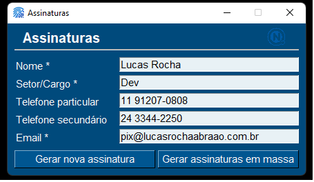

# Assinatura-gen

Esse repositório hospeda o código do Gerador de assinaturas de e-mail dos colaboradores da QUICK FIBRA. A manutenção da criação de assinaturas de e-mails é desgastante, pois com mudanças no quadro de colaboradores e na mudança de cargos, é necessário criar / excluir / alterar cada campo das assinaturas, que são editadas por uma agência de marketing. Eu criei esse app para que cada colaborador seja capaz de editar a própria assinatura, sob supervisão de seu gestor. Dessa forma, fica muito mais fácil manter tudo atualizado, principalmente com o crescimento do quadro de colaboradores.

Minha assinatura como exemplo (note que cada campo de texto na porte da direita da imagem é gerado pelo script):

Status atual (em desenvolvimento):
Estava pensando em fazer uma página web onde cada funcionário gerencia sua própria assinatura. Mas mudei de ideia, e vou fazer um simples desktop app onde o RH gerencia essas assinaturas, usando SimplePyGui. Por enquanto, ainda funciona através de script. Essa mesma funcionalidade de script vai passar pro app. Eventualmente posso pensar em refazer o projeto todo em Pygame (ou parecido), onde terei mais possibilidades de manipular a imagem.

#### Instalação da interface gráfica
Para instalar o app e criar um executável, faça assim:
- Instale os pacotes do requirements.txt (`pip install -r requirements.txt`)
- execute o comando: `python -m pysimplegui-exemaker.pysimplegui-exemaker`
- Na nova janela, busque pelo código fonte (`gui_assinaturas.py`) e o ícone (`resources/img/assinatura_64px.ico`), e clique no botão 'Make EXE'.

Em alguns segundos haverá um executável (.exe) no mesmo diretório que o arquivo fonte. Caso queira colocar o executável em outro local, criei um atalho. O arquivo original deve sempre estar na mesma pasta relativa que os arquivos e pastas `assinaturas_personalizadas`, `elenco.csv`, `resources`, `src`. Já o atalho pode ser colocado em qualquer lugar, que vai conseguir encontrar esses arquivos e pastas sem problemas.

##### TODO
- Permitir rodar o botão de gerar assinaturas em massa sem precisar apagar tudo antes (o script já faz isso, mas o ideal é ter uma checagem).
